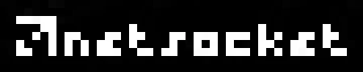

<p align="center">
  
</p>

<p align="center">
  
  
  
</p>

<p align="center">
  Netsocket is a deeply-integrated, expandable nodegraph editor for creating automations.
</p>

# Usage
> [!NOTE]
> 
> By default, new installs should prefer to use **Docker** or an official tag from **Releases** rather than running from source, because this repository may contain bugs or critical issues at any time, which are fixed before releases.
>
> If you intend to add custom nodes, extend or implement functionality, or otherwise develop for netsocket, you likely want to use the Node.js "development" install instead of Docker.
### Docker
- Image: [strayfade/netsocket](https://hub.docker.com/repository/docker/strayfade/netsocket/general)
- Run from command line:
```
docker run -e HOSTNAME="0.0.0.0" -e PORT="4675" -p 4675:4675 strayfade/netsocket
```
- `compose.yaml`
```yaml
version: "3.8"
services:
  netsocket:
    image: strayfade/netsocket:latest
    container_name: netsocket
    ports:
      - 4675:4675
    environment:
      - PORT=4675
      - HOSTNAME=0.0.0.0
    restart: always
```
- Go to [http://localhost:4675](http://localhost:4675).

### Node.js (development only)
> [!IMPORTANT]
> New installations of netsocket should use Docker, or an official release from the Releases page, rather than pulling code from this repository directly.
- Clone netsocket and install dependencies
```
git clone https://github.com/strayfade/netsocket
cd netsocket
npm install
```
- Run netsocket
```
npm start
```
- Go to [http://localhost:4675](http://localhost:4675).

# Guide (post-install)
### Basic setup
1. Navigate to [http://localhost:4675](http://localhost:4675).
2. Create an account (if this is your first run).
3. You should be redirected to `/dashboard`. This is the main page for creating automations.
### Create your first automation
  - Right-click the canvas to add a new node
  - Go to **Add Node > Triggers > Button** and add a Button node.
  - Right click again, go to **Add Node > Debugging > Print** to add a Print node.
  - Starting from the Button node, click and drag the *Execute* output connection from the Button node to the *Execute* input connection on the Print node.
  - *But what will be printed?* Double-click on the Print node to open the Parameters panel. In the **Text** box, type in "Hello, world!" and press Enter.
  - Click the Close button on the Parameters panel.
> [!TIP]
> You may notice that on the inputs for the Print node, there is an input labeled "Text" which has the same name as the parameter we just set. This is intentional — a direct connection to the node will override any values set inside the Parameters panel. If the connection is disconnected, the Parameters panel value will be used.
  - Press the "button" section of the Button node, and you will see a "Hello, world!" printed to the **netsocket Log** at the bottom of the page. Hovering over this log will expand it to show more lines.
### Controls
- **Right-click** - add nodes
- **Shift + Click** - multiselect nodes
- **Shift + Drag** - move multiple nodes
- **Alt + Drag** - clone the clicked node
- **Ctrl + C** - copy nodes
- **Ctrl + V** - paste nodes
- **Double-click** - edit node parameters